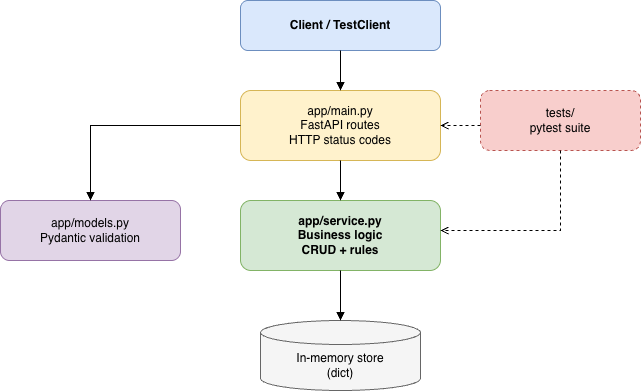
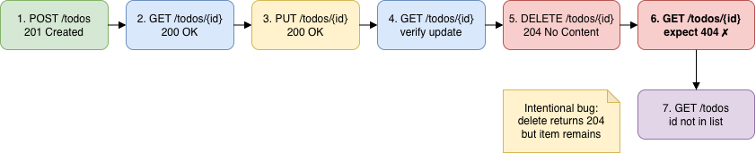
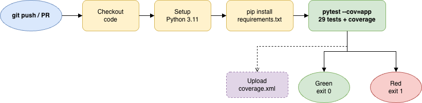

# Todo API — SDET Testing Sample Project

A small **FastAPI** Todo API with a full **pytest** automation suite — unit tests, API integration tests, E2E workflow tests, CI, and coverage reporting.

Built to practice software testing in a realistic but beginner-friendly way: validation rules, erroneous scenarios, defect documentation, and a deliberate bug to hunt down.

---

## Features

- **REST CRUD API** — create, read, update, delete todos
- **Input validation** — empty titles, duplicates, not-found handling (`422`, `409`, `404`)
- **Layered test suite** — 29 automated tests across unit, API, and E2E layers
- **AI-reviewed tests** — example of human-reviewed AI-suggested negative cases
- **GitHub Actions CI** — runs tests + coverage on every push/PR
- **Sample QA artifacts** — test plan, bug report, SDET concepts guide
- **Intentional delete bug** — 3 tests fail until you fix `delete_todo()` (see [BUG_REPORT.md](BUG_REPORT.md))

---

## Tech Stack

| Layer | Tools |
|-------|-------|
| API | [FastAPI](https://fastapi.tiangolo.com/), [Pydantic](https://docs.pydantic.dev/) |
| Tests | [pytest](https://docs.pytest.org/), FastAPI `TestClient`, [pytest-cov](https://pytest-cov.readthedocs.io/) |
| CI | GitHub Actions |
| Runtime | Python 3.9+ |

---

## Architecture

> **Diagram:** Export `docs/diagrams/architecture.drawio` → save as `docs/images/architecture.png`



```text
Client / TestClient
       ↓
app/main.py      ← HTTP routes, status codes
       ↓
app/models.py    ← request validation (Pydantic)
app/service.py   ← business logic (unit-testable)
       ↓
in-memory store
```

---

## Test Pyramid

> **Diagram:** Export `docs/diagrams/test-pyramid.drawio` → save as `docs/images/test-pyramid.png`


| Layer | File | Count | What it checks |
|-------|------|-------|----------------|
| Unit | `tests/test_unit_service.py` | 9 | Business rules in isolation |
| API | `tests/test_api.py` | 14 | HTTP contracts & status codes |
| API (AI-reviewed) | `tests/test_api_ai_reviewed.py` | 5 | Negative / edge cases |
| E2E | `tests/test_e2e_workflow.py` | 1 | Full CRUD user journey |

---

## E2E Workflow

> **Diagram:** Export `docs/diagrams/e2e-workflow.drawio` → save as `docs/images/e2e-workflow.png`



The workflow test chains: **create → get → update → get → delete → confirm gone**.

---

## CI Pipeline

> **Diagram:** Export `docs/diagrams/ci-pipeline.drawio` → save as `docs/images/ci-pipeline.png`



Workflow file: [`.github/workflows/ci.yml`](.github/workflows/ci.yml)

---

## Quick Start

### Prerequisites

- Python 3.9+
- `pip` and `make` (optional)

### Install & run

```bash
git clone https://github.com/YOUR_USERNAME/YOUR_REPO.git
cd sdet-mini-project

python3 -m venv .venv
source .venv/bin/activate   # Windows: .venv\Scripts\activate

make install
make test       # run all tests
make coverage   # tests + coverage report
make run        # API at http://localhost:8000/docs
```

### Expected test result

```text
26 passed, 3 failed   # intentional delete bug
```

Fix `delete_todo()` in `app/service.py` (add `del _store[todo_id]`) → all 29 pass.

---

## API Endpoints

| Method | Path | Description | Success |
|--------|------|-------------|---------|
| `GET` | `/health` | Health check | `200` |
| `POST` | `/todos` | Create todo | `201` |
| `GET` | `/todos` | List all todos | `200` |
| `GET` | `/todos/{id}` | Get one todo | `200` / `404` |
| `PUT` | `/todos/{id}` | Update todo | `200` / `404` / `409` |
| `DELETE` | `/todos/{id}` | Delete todo | `204` / `404` |

Interactive docs: http://localhost:8000/docs

### Example

```bash
# Create
curl -X POST http://localhost:8000/todos \
  -H "Content-Type: application/json" \
  -d '{"title": "Buy milk", "description": "Weekly groceries"}'

# List
curl http://localhost:8000/todos
```

---

## Project Structure

```text
├── app/
│   ├── main.py              # FastAPI routes
│   ├── models.py            # Pydantic schemas
│   └── service.py           # Business logic
├── tests/
│   ├── test_unit_service.py
│   ├── test_api.py
│   ├── test_api_ai_reviewed.py
│   └── test_e2e_workflow.py
├── docs/
│   ├── diagrams/            # Editable .drawio sources
│   └── images/            # Export PNGs here for README
├── .github/workflows/ci.yml
├── TEST_PLAN.md
├── BUG_REPORT.md
├── AI_TESTING_REVIEW.md
├── SDET_GUIDE.md            # SDET concepts & learning notes
├── Makefile
└── requirements.txt
```

---

## Documentation

| Document | Description |
|----------|-------------|
| [SDET_GUIDE.md](SDET_GUIDE.md) | What an SDET does — concepts mapped to this repo |
| [TEST_PLAN.md](TEST_PLAN.md) | Acceptance criteria, scenarios, regression risks |
| [BUG_REPORT.md](BUG_REPORT.md) | Sample defect report for the delete bug |
| [AI_TESTING_REVIEW.md](AI_TESTING_REVIEW.md) | AI-suggested tests — kept vs rejected |
| [docs/diagrams/README.md](docs/diagrams/README.md) | How to export diagram PNGs |

---

## Makefile Commands

| Command | Description |
|---------|-------------|
| `make install` | Install dependencies |
| `make test` | Run full pytest suite |
| `make coverage` | Run tests with coverage + HTML report |
| `make test-ci` | Same command GitHub Actions runs |
| `make run` | Start local API server |

---

## Learning Exercise

1. Run `make test` and observe 3 failures
2. Read [BUG_REPORT.md](BUG_REPORT.md)
3. Fix `delete_todo()` in `app/service.py`
4. Re-run tests — all green
5. Read [SDET_GUIDE.md](SDET_GUIDE.md) to connect tests to SDET practices

---

## Diagram Setup (one-time)

PNG placeholders above won't render until you export them:

1. Open files in `docs/diagrams/` at [diagrams.net](https://app.diagrams.net/)
2. Export each as PNG to `docs/images/`
3. Commit the PNG files

See [docs/diagrams/README.md](docs/diagrams/README.md) for details.

---

## License

MIT — feel free to use for learning and portfolio purposes.
